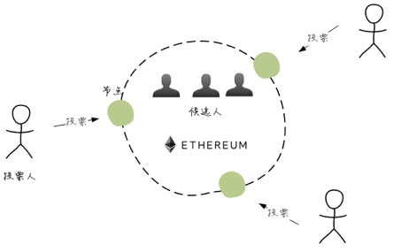
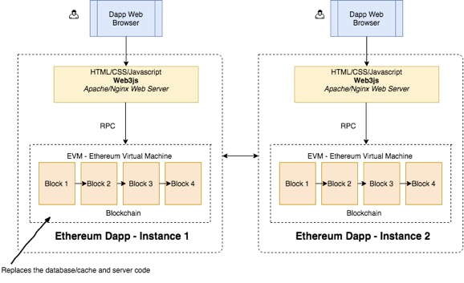
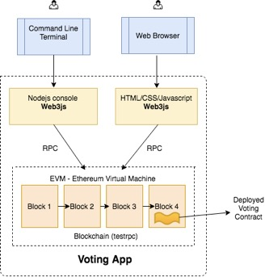
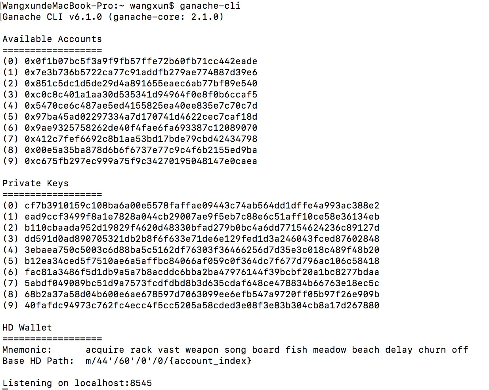
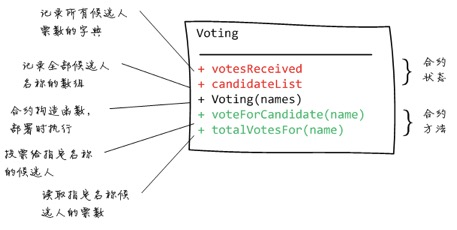
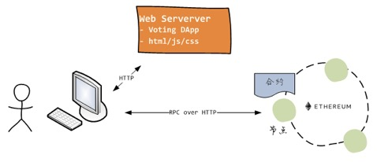
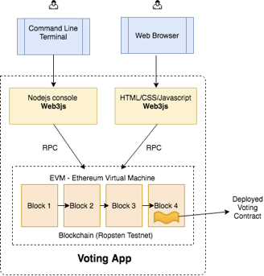

>&emsp;&emsp;&emsp;&emsp;区块链技术其实大概已经出来很长一段时间了，只是在去年随着各种ico着实是火了一把。如同很多刚出现的技术与概念一样，信仰者奉之为神，觉得甚至是可以在短时间内颠覆支付宝的东西；而不信的人又是嗤之以鼻，认为不过都是些骗人的老套路套着新概念又重出江湖了。这是最好的时代，也是最坏的时代，人人都可能相比于几十年前不用那么勤奋努力很多很多年才能获得足够的财富，而就是因为人人都有机会，才让竞争也变得激烈异常。
>
>&emsp;&emsp;&emsp;&emsp;作为技术研究者一般都信仰技术无罪，本文也无意谈太多技术之外的八卦，文章的技术核心内容基本都是来自于网上加以整理和实践，没有比模仿更适合了解和掌握一门新技术了。

<!-- more -->

### 一.项目框架概述
  
&emsp;&emsp;&emsp;&emsp;上图反应出一种互不信任的，去中心化的投票系统架构图，和其他去中心化系统一样，它并没有一个中央服务器来保存数据，每个运行的节点（用户运行的客户端）都保留一份完整的全链路数据，区块链不断增长且不可篡改，每个节点都完全平等。每次数据的变动都是客户端与各自节点实例的交互，然后广播全网络同步的过程，如下图


&emsp;&emsp;&emsp;&emsp;当然，这是一种比较理想的情况，在移动互联网时代这可能是最急迫需要解决的问题，相信也很少有人能够忍受在手机上运行DAPP像目前在PC上打开以太坊钱包那样可能等上个一整天。所以，区块链社区也已经出现了一些解决方案，例如提供公共区块链节点的Infura, 以及浏览器插件Metamask等。通过这些方案，就不需要花费大量的硬盘、内存和时间去下载并运行完整的区块链节点，同时也可以利用去中心化的优点。当然这并不是本文所要讨论的重点。

&emsp;&emsp;&emsp;&emsp;以下是本次应用的架构图


&emsp;&emsp;&emsp;&emsp;从图中可以看到，网页通过（HTTP上的）远程过程调用（RPC：Remote Procedure Call）与区块链节点进行通信。`web3.js`已经封装了以太坊规定的全部RPC调用，因此利用它就可以与区块链进行交互，而不必手写那些RPC请求包。使用`web3.js`的另一个好处是，你可以使用自己喜欢的前端框架来构建出色的web应用。

&emsp;&emsp;&emsp;&emsp;由于获得一个同步的全节点相当耗时，并占用大量磁盘空间。为了在我们对区块链的兴趣消失之前掌握如何开发一个去中心化应用，本文将使用`ganache`软件来模拟区块链节点，以便快速开发并测试应用，从而可以将注意力集中在去中心化的思想理解与DApp应用逻辑开发方面。

&emsp;&emsp;&emsp;&emsp;接下来，我们将编写一个投票合约，然后编译合约并将其部署到区块链节点 —— `ganache`上。

&emsp;&emsp;&emsp;&emsp;最后，我们将分别通过命令行和网页这两种方式，与区块链进行交互。

### 二.使用Node.js进行第一次迭代
#### 2.1 

>&emsp;&emsp;&emsp;&emsp;由于各自环境的不同，这里以MAC为准，其他平台可以自行用谷歌百度一下。

由上文可知，首先是安卓`gannache`
`sudo npm install -g ganache-cli`
这个软件相当于可以在本地跑一个私链，可以百度先了解一下
>Ganache：以前叫作 TestRPC，如果你读过几个月前的教程的话，有可能他们在使用 TestRPC 的情境下配合使用了 Truffle，它在 TestRPC 和 Truffle 的集成后被重新命名为 Ganache。Ganache 的工作很简单：创建一个虚拟的以太坊区块链，并生成一些我们将在开发过程中用到的虚拟账号。

安装完毕后在控制台输入`ganache-cli`命令，可以看到以下结果

这样就相当于一个私链已经存在了，并且`ganache`默认创建了10个测试账号，每个账号里面也会有一些余额。

当然还有一个GUI版本的，有兴趣也可以用这个
`http://truffleframework.com/ganache/#2/_blank`

&emsp;&emsp;&emsp;&emsp;以太坊开发目前都是使用`Solidity`语言进行开发，个人感觉如果有面向对象基础的话就不要从最最基本的语法看起，可能还没看完就直接放弃了。下图是投票合约的主要接口

基本上，投票合约Voting包含以下内容：

- 构造函数，用来初始化候选人名单。
- 投票方法Vote()，每次执行就将指定的候选人得票数加 1
- 得票查询方法totalVotesFor()，执行后将返回指定候选人的得票数

有几点需要特别指出：

- 合约状态是持久化到区块链上的，因此对合约状态的修改需要消耗以太币。
- 只有在合约部署到区块链的时候，才会调用构造函数，并且只调用一次。
- 与 web 世界里每次部署代码都会覆盖旧代码不同，在区块链上部署的合约是不可改变的，也就是说，如果你更新合约并再次部署，旧的合约仍然会在区块链上存在，并且合约的状态数据也依然存在。新的部署将会创建合约的一个新的实例。

#### 2.2
下面直接看看投票合约代码

```
pragma solidity ^0.4.18;

contract Voting {

  mapping (bytes32 => uint8) public votesReceived;
  bytes32[] public candidateList;

  function Voting(bytes32[] candidateNames) public {
    candidateList = candidateNames;
  }

  function totalVotesFor(bytes32 candidate) view public returns (uint8) {
    require(validCandidate(candidate));
    return votesReceived[candidate];
  }

  function voteForCandidate(bytes32 candidate) public {
    require(validCandidate(candidate));
    votesReceived[candidate]  += 1;
  }

  function validCandidate(bytes32 candidate) view public returns (bool) {
    for(uint i = 0; i < candidateList.length; i++) {
      if (candidateList[i] == candidate) {
        return true;
      }
    }
    return false;
   }
}
```
大概有几个点

- 编译器版本声明
- 合约类声明，构造函数
- 字典，数组
- 函数，断言

稍微看看应该就基本都能看懂了。

我们使用`solc`库来编译合约代码。然后使用`web3js`库，它能够让你通过RPC与区块链进行交互。我们将在node控制台里用这个库编译和部署合约，并与区块链进行交互。
首先，请确保ganache已经在第一个终端窗口中运行：`~$ ganache-cli`。

`$ node`

`> Web3 = require('web3')`

`> web3 = new Web3(new Web3.providers.HttpProvider("http://localhost:8545"));`

`> web3.eth.accounts`

要编译合约，首先需要载入`Voting.sol`文件的内容，然后使用编译器（solc）的compile()方法对合约代码进行编译：

`> code = fs.readFileSync('Voting.sol').toString()`

`> solc = require('solc')`

`> compiledCode = solc.compile(code)`

以上只要没报错就OK，尤其是`compiledCode`,会出现特别多的输出信息。
其中包含两个重要的字段：

- `compiledCode.contracts[':Voting'].bytecode`: 投票合约编译后的字节码，也是要部署到区块链上的代码。
- `compiledCode.contracts[':Voting'].interface`: 投票合约的接口，被称为应用二进制接口（ABI：Application Binary Interface），它声明了合约中包含的接口方法。无论何时需要跟一个合约进行交互，都需要该合约的abi定义。

#### 2.3
合约编译基本已完成，接下来看看怎么部署到区块链上去。
为此，需要先传入合约的abi定义来创建合约对象`VotingContract`，然后利用该对象完成合约在链上的部署和初始化。
命令如下
`> abiDefinition = JSON.parse(compiledCode.contracts[':Voting'].interface)`

`> VotingContract = web3.eth.contract(abiDefinition)`

`> byteCode = compiledCode.contracts[':Voting'].bytecode`

`> deployedContract = VotingContract.new(['Rama','Nick','Jose'],{data: byteCode, from: web3.eth.accounts[0], gas: 4700000})`

`> deployedContract.address`

`> contractInstance = VotingContract.at(deployedContract.address)`

调用`VotingContract`对象的`new()`方法来将投票合约部署到区块链。new()方法参数列表应当与合约的 构造函数要求相一致。对于投票合约而言，new()方法的第一个参数是候选人名单。

`new()`方法的最后一个参数用来声明部署选项。现在让我们来看一下这个参数的内容：

```
{
  data: byteCode,             //合约字节码
  from: web3.eth.accounts[0], //部署者账户，将从这个账户扣除执行部署交易的开销
  gas: 4700000                //愿意为本次部署最多支付多少油费，单位：Wei
}
```

- data: 这是合约编译后，需要部署到区块链上的合约字节码。
- from: 区块链必须跟踪是谁部署了一个合约。在本例中，我们简单地利用`web3.eth.accounts`返回的第一个账户，作为部署这个合约的账户。在提交交易之前，你必须拥有并解锁这个账户。不过为了方便起见，ganache默认会自动解锁这10个账户。
- gas: 与区块链进行交互需要消耗资金。这笔钱用来付给矿工，因为他们帮你把代码部署到在区块链里。你必须声明愿意花费多少资金让你的代码包含在区块链中，也就是设定`gas`的值。`from`字段声明的账户的余额将会被用来购买 `gas`。`gas`的价格则由区块链网络设定。

#### 2.4
拿到`contractInstance`实例之后可以根据合约定义的接口进行一系列的操作了。

调用合约的`totalVotesFor()`方法来查看某个候选人的得票数。
例如，下面的代码 查看候选人Rama的得票数：
`contractInstance.totalVotesFor.call('Rama')`

```
{ [String: '0'] s: 1, e: 0, c: [ 0 ] }
是数字 0 的科学计数法表示. 
```

调用合约的`voteForCandidate()`方法投票给某个候选人。下面的代码给Rama投了三次票：

`> contractInstance.voteForCandidate('Rama', {from: web3.eth.accounts[0]})`
`> contractInstance.voteForCandidate('Rama', {from: web3.eth.accounts[0]})`
`> contractInstance.voteForCandidate('Rama', {from: web3.eth.accounts[0]})`

现在我们再次查看Rama的得票数：
`>contractInstance.totalVotesFor.call('Rama').toLocaleString()`

```
'3'
```
投票 = 交易

每执行一次投票，就会产生一次交易，因此`voteForCandidate()`方法将返回一个交易id，作为交易的凭据。比如：`0xdedc7ae544c3dde74ab5a0b07422c5a51b5240603d31074f5b75c0ebc786bf53`。交易id是交易发生的凭据，交易是不可篡改的，因此任何时候可以使用交易id引用或查看交易内容都会得到同样的结果。对于区块链而言，`交易不可篡改`是其核心特性。

#### 2.5
让用户使用命令行显然是非常不友好的，所以接下来尝试使用网页来作为前端交互页面。

页面的主要功能如下：

- 列出所有的候选人及其得票数
- 用户在页面中可以输入候选人的名称，然后点击投票按钮，网页中的JS代码将调用投票合约的`voteForCandidate()`方法 —— 和我们nodejs控制台里的流程一样。

先来看看html代码

```
<!DOCTYPE html>
<html>
<head>
 <title>Hello World DApp</title>
 <link href='/lib/gfonts.css' rel='stylesheet' type='text/css'>
 <link href='/lib/bootstrap.min.css' rel='stylesheet' type='text/css'>
</head>
<body class="container">
 <h1>A Simple Hello World Voting Application</h1>
 <div class="table-responsive">
  <table class="table table-bordered">
   <thead>
    <tr>
     <th>Candidate</th>
     <th>Votes</th>
    </tr>
   </thead>
   <tbody>
    <tr>
     <td>Rama</td>
     <td id="candidate-1"></td>
    </tr>
    <tr>
     <td>Nick</td>
     <td id="candidate-2"></td>
    </tr>
    <tr>
     <td>Jose</td>
     <td id="candidate-3"></td>
    </tr>
   </tbody>
  </table>
 </div>
 <input type="text" id="candidate" />
 <a href="#" onclick="voteForCandidate()" class="btn btn-primary">Vote</a>
</body>
<script src="/lib/web3.js"></script>
<script src="/lib/jquery-3.1.1.slim.min.js"></script>
<script src="./index.js"></script>
</html>
```
里面引用了一些基本的JS库，此外还有web3.js和index.js，为了方便跑代码把这文章的相关代码都传上了git,需者自取。
>https://github.com/same4869/dappDemo

其他的js文件包括web3.js都是库文件，没什么业务逻辑，而需要我们关注的是`index.js`这个文件，也是我们自己写的js文件。

```
web3 = new Web3(new Web3.providers.HttpProvider("http://192.168.0.6:8545"));
abi = JSON.parse('[{"constant":false,"inputs":[{"name":"candidate","type":"bytes32"}],"name":"totalVotesFor","outputs":[{"name":"","type":"uint8"}],"payable":false,"type":"function"},{"constant":false,"inputs":[{"name":"candidate","type":"bytes32"}],"name":"validCandidate","outputs":[{"name":"","type":"bool"}],"payable":false,"type":"function"},{"constant":true,"inputs":[{"name":"","type":"bytes32"}],"name":"votesReceived","outputs":[{"name":"","type":"uint8"}],"payable":false,"type":"function"},{"constant":true,"inputs":[{"name":"x","type":"bytes32"}],"name":"bytes32ToString","outputs":[{"name":"","type":"string"}],"payable":false,"type":"function"},{"constant":true,"inputs":[{"name":"","type":"uint256"}],"name":"candidateList","outputs":[{"name":"","type":"bytes32"}],"payable":false,"type":"function"},{"constant":false,"inputs":[{"name":"candidate","type":"bytes32"}],"name":"voteForCandidate","outputs":[],"payable":false,"type":"function"},{"constant":true,"inputs":[],"name":"contractOwner","outputs":[{"name":"","type":"address"}],"payable":false,"type":"function"},{"inputs":[{"name":"candidateNames","type":"bytes32[]"}],"payable":false,"type":"constructor"}]')
VotingContract = web3.eth.contract(abi);
contractInstance = VotingContract.at('0x1eb79b83e6e8c9ca16355c5a817ad9fa456e1e03');
candidates = {"Rama": "candidate-1", "Nick": "candidate-2", "Jose": "candidate-3"}

function voteForCandidate(candidate) {
 candidateName = $("#candidate").val();
 try {
  contractInstance.voteForCandidate(candidateName, {from: web3.eth.accounts[0]}, function() {
   let div_id = candidates[candidateName];
   $("#"+div_id).html(contractInstance.totalVotesFor.call(candidateName).toString());
  });
 } catch (err) {
 }
}

$(document).ready(function() {
 candidateNames = Object.keys(candidates);
 for (var i = 0; i < candidateNames.length; i++) {
  let name = candidateNames[i];
  let val = contractInstance.totalVotesFor.call(name).toString()
  $("#"+candidates[name]).html(val);
 }
});
```

为了将页面运行起来，需要对JS代码进行一下调整：
节点的RPC API地址
`web3 = new Web3(new Web3.providers.HttpProvider("http://localhost:8545"));`
HttpProvier()对象的构造函数参数是web3js库需要链接的以太坊节点RPC API的URL。

当一个合约部署到区块链上时，将获得一个地址，例如`0x329f5c190380ebcf640a90d06eb1db2d68503a53`。 

由于每次部署都会获得一个不同的地址，因此你需要指定它：
`contractInstance = VotingContract.at('0x329f5c190380ebcf640a90d06eb1db2d68503a53')`

在第二个终端中输入以下命令来启动一个简单的Web服务器，以便我们可以在试验环境中的嵌入浏览器中访问页面：

```
~$ cd ~/repo/chapter1
~/repo/chapter1$ python -m SimpleHTTPServer

(python3) python -m http.server 80
```
Python的`SimpleHTTPServer`模块将启动在8000端口的监听。
现在，在试验环境的嵌入浏览器中点击刷新按钮。如果一切顺利的话，你应该可以看到投票应用的页面了。 当你在文本框中输入候选人姓名，例如Rama，然后点击按钮后，应该会看到候选人Rama的得票数加 1 。

#### 2.6
如果能看到页面，并能够正常投票，第一个基本demo已经能跑起来了。

总结一下，下面是我们到目前为止已经完成的事情：

- 使用nodejs,npm和ganache作为开发环境。
- 开发简单的投票合约，编译并部署到区块链节点上。
- 使用nodejs控制台与合约交互。
- 编写网页与合约交互。
- 所有的投票都保存到区块链上，并且不可修改。
- 任何人都可以独立验证每个候选人获得了多少投票。

### 三.使用Truffle进行第二次迭代
#### 3.1
上一章我们已经基于区块链（ganache仿真器）实现了一个投票合约，并且成功通过nodejs控制台和网页实现了与合约的交互。


而接下来我们试着做以下这些事

- 使用`Truffle`框架开发投票应用，它可以方便地编译、部署合约。
- 修改已有的投票应用代码，以便适配开发框架。
- 利用Truffle控制台、网页与投票合约进行交互。
- 对投票合约进行扩展，加入通证（`token`）及购买功能。
- 对前端代码进行扩展，通过网页前端购买股票通证，并利用股票通证为候选人投票。

`Truffle `可以先了解下，和各种PHP啊Python啊JS啊框架异曲同工，能帮助开发者开发DAPP事半功倍。

首先还是安装
`~$ npm install -g truffle`

`Truffle`提供了众多的项目模版，可以快速搭建一个去中心化应用的骨架代码。下面的代码使用webpack项目模版来创建应用tfapp:

```
~$ mkdir -p ~/repo/tfapp
~$ cd ~/repo/tfapp
~/repo/tfapp$ truffle unbox webpack
```

初始化一个`Truffle`项目时，它会创建运行一个完整的DApp所需的文件和目录。 可以使用ls命令来查看生成的项目结构：

```
~/repo/tfapp$ ls
README.md       contracts       node_modules      test          webpack.config.js   truffle.js
app          migrations       package.json
~/repo/tfapp$ ls app/
index.html javascripts stylesheets
~/repo/tfapp$ ls contracts/
ConvertLib.sol MetaCoin.sol Migrations.sol
~/repo/tfapp$ ls migrations/
1_initial_migration.js 2_deploy_contracts.js
```

前面的章节中主要自己编写了3个文件，分别是`Voting.sol`,`index.html`与`index.js`，现在对这几个文件分别进行处理，以便应用到Truffle生成的应用中。

`Voting.sol`

> 合约文件不需要修改，直接拷贝到 `contracts `目录即可：
```
~/repo/tfapp$ cp ../chapter1/Voting.sol contracts/
~/repo/tfapp$ ls contracts/
Migrations.sol Voting.sol
```


`index.html`

> 先将页面文件拷贝到`app`目录，覆盖Truffle生成的`index.html`：
> 
```
~/repo/tfapp$ cp ../chapter1/index.html app/
```
由于`Truffle`的`webpack`模版在打包JS脚本时，默认使用`app.js`作为打包入口， 因此，我们将页面文件中对`index.js`的引用改为对`app.js`的引用：
`<script src="app.js"></script>`


`app.js`
> 在`Truffle`下，我们需要重写与区块链交互的JS脚本。由于使用webpack打包，因此可以使用`ES2015`语法。
> 
当使用Truffle来编译和部署合约时，框架会将合约的应用接口定义（abi：Application Binary interface）以及部署地址保存到build/contracts目录中同名的json文件中 —— 我们不需要自己记部署地址了！ 例如，Voting.sol的部署信息对应与build/contracts/Voting.json文件。利用这个文件就可以创建投票合约对象：
>
```
import voting_artifacts from '../../build/contracts/Voting.json'
var Voting = contract(voting_artifacts)
```
>
合约对象的`deployed()`方法返回一个`Promise`，其解析值为该合约对象的部署实例代理（真正的实例在链上），利用这个代理可以执行合约的方法：
>
```
Voting.deployed()
  .then(instance => instance.voteForCandidate('Rama')) 
  .then(() => instance.totalVotesFor.call('Rama'))
  .then(votes => console.log('Rama got votes: ', votes))
```

可以根据git下来的结构目标查看对应的文件自行参考与替换。

#### 3.2
`迁移（migration`）目录的内容非常重要。Truffle使用该目录下的迁移脚本来管理应用合约的部署。 我们在之前的操作中，是通过在 node 控制台中调用合约对象的new()方法来将投票合约部署到区块链上。有了Truffle，以后再也不需要这么做了。

第一个迁移脚本`1_initial_migration.js`的作用是向区块链部署Migrations合约， 这个合约的作用是存储并跟踪已经部署的最新合约。每次运行迁移任务时，Truffle就会向区块链查询获取 已部署好的合约，然后部署新的合约。在部署完成后，这个脚本会更新Migrations合约中的`last_completed_migration`字段指向最新部署的合约。
可以简单地把Migrations合约当成是一个`数据库表`，字段`last_completed_migration`总是保持最新状态。

将迁移脚本`2_deploy_contracts.js`的内容修改为以下内容，以便部署我们的投票合约Voting：

```
var Voting = artifacts.require("./Voting.sol");
module.exports = function(deployer) {
 deployer.deploy(Voting, ['Rama', 'Nick', 'Jose'], {gas: 290000});
};
```

从上面的代码可以看出，Truffle框架将向迁移脚本传入一个部署器对象（`deployer`），调用其deploy() 方法即可实现指定合约的部署。

deploy()方法的第一个参数为要部署合约的编译对象，调用`artifacts.require()`即可直接将合约代码转换为合约编译对象，例如：`artifacts.require('./Voting.sol')` 。

容易理解，Truffle的`artifacts`对象自动调用solidity编译器来编译合约代码文件并返回编译结果对象。

`deploy()`方法的最后一个参数是合约实例化选项对象，可以用来指定部署代码所需的油费 —— 别忘了部署合约也是交易，因此需要烧点油（`gas`）。gas 数量会随着你的合约大小而变化 —— 确切的说，部署一个合约所需的油费取决于编译生成的合约字节码，不同的字节码指令对应不同的开销，累加起来就可以估算出部署费用。

对于投票合约而言，290000个油就足够了 —— 这个价格是我们为部署这个合约愿意承担的最大费用（gasLimit），最终的开支可能用不了这么多。当然，如果你的合约很复杂，有可能你愿意买单的这个上限还不够，那么 节点就会返回一个提示，告诉你部署失败，油资不足 —— `Out of gas`

`deploy()`方法的第一个参数和最后一个参数之间，需要按合约构造函数的参数要求依次传入。例如，对于投票合约，我们只需传入一个候选人名单（数组）。

Truffle在执行任务时，将读取当前目录下的配置文件`truffle.js`。通常我们在该配置文件中声明要连接的以太坊节点地址，例如`localhost:8545`：

```
require('babel-register')module.exports = {
 networks: {
  dev: {
   host: 'localhost',
   port: 8545,
   network_id: '*',
   gas: 470000
  }
 }
}
```

你应该会注意到gas选项。这是一个会应用到所有迁移任务的全局变量。当我们调用`deploy()`方法部署一个合约时，如果没有声明愿意承担的油费，那么Truffle就会采用这个值作为该合约的部署油资。

另一个值得指出的是，Truffle支持将合约部署到多个区块链网络，例如开发网络、私有网络、测试网或公网。 在上面的配置文件中，我们仅定义了一个用于开发的网络dev —— 你知道它指向的是ganache模拟器，Truffle 在执行命令时将自动连接到这个网络。

#### 3.3
在Truffle中执行`compile`命令来编译contracts下的所有合约：

```
~/repo/tfapp$ truffle compile
Compiling Migrations.sol...
Compiling Voting.sol...
Writing artifacts to ./build/contracts
```

在Truffle中执行`migrate`命令将编译后的合约部署到链上：

```
~/repo/tfapp$ truffle migrate
Running migration: 1_initial_migration.js
Deploying Migrations...Migrations: 0x3cee101c94f8a06d549334372181bc5a7b3a8bee
Saving successful migration to network...
Saving artifacts...
Running migration: 2_deploy_contracts.js
Deploying Voting...Voting: 0xd24a32f0ee12f5e9d233a2ebab5a53d4d4986203
Saving successful migration to network...
Saving artifacts...

```
以上如果有编译错误可以根据提示解决。

如果由于油费不足而导致部署失败，可以尝试增加`migrations/2_deploy_contracts.js` 里面的 `gas` 值。比如：

```
deployer.deploy(Voting, ['Rama', 'Nick', 'Jose'], {gas: 500000})
```
如果希望自选一个账户来部署合约，而不是使用默认的`accounts[0]`，可以在迁移脚本中使用from 选项指定，例如：

```
deployer.deploy(Voting, ['Rama', 'Nick', 'Jose'], {gas: 500000,from:'0x8cff691c888afe73ffa3965db39be96ba3b34e49'})
```
 
也可以在 `truffle.js` 中指定默认的用来与区块链交互的账户地址：

```
module.exports = {
 networks: {
  dev: {
   host: 'localhost',
   port: 8545,
   network_id: '*',
   gas: 470000,
   from: '0x8cff691c888afe73ffa3965db39be96ba3b34e49'
  }
 }
}
```

#### 3.4
部署顺利的话，现在就可以通过控制台和网页与合约进行交互了。
使用`Truffle控制台`
在第二个终端中输入`truffle console`命令进入控制台：

```
~/repo/tfapp$ truffle console
truffle(development)> Voting.deployed().then(function(contractInstance) {contractInstance.voteForCandidate('Rama').then(function(v) {console.log(v)})})

{ blockHash: '0x7229f668db0ac335cdd0c4c86e0394a35dd471a1095b8fafb52ebd7671433156',blockNumber: 469628,contractAddress: null,
....
....
```

```
truffle(default)> Voting.deployed().then(function(contractInstance) {contractInstance.totalVotesFor.call('Rama').then(function(v) {console.log(v)})})
{ [String: '1'] s: 1, e: 0, c: [ 1] }
```

注意，truffle 的所有调用都会返回promise，这就是为什么每个响应都被包裹在 `then() `函数里的原因。

通过网页交互
首先在

```
~/repo/tfapp$ webpack
```
在build目录下生成相应的文件，注意webpack的版本，可以用npm进行调整，被这个坑坑了半天时间。

然后进入`build`目录，先建立网页资源文件的符号连接，然后启动web服务器：

```
~/repo/tfapp/build$ ln -s ~/repo/common/lib lib
~/repo/tfapp/build$ ln -s ~/repo/common/fonts fonts
~/repo/tfapp/build$ python -m SimpleHTTPServer
（python3）python -m http.server 8000
```

现在，在实验环境的嵌入浏览器中点击刷新按钮。
